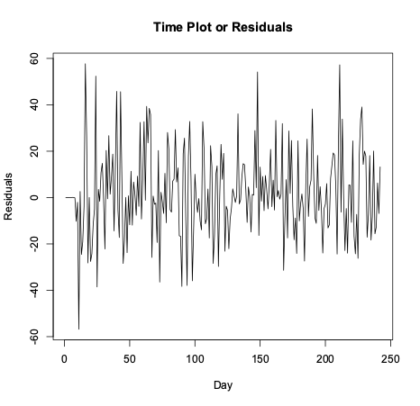
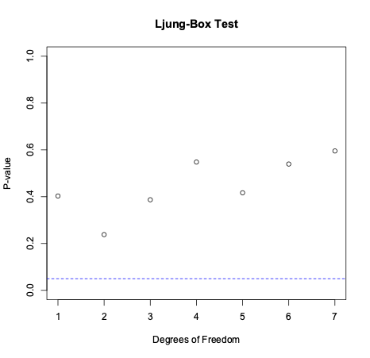
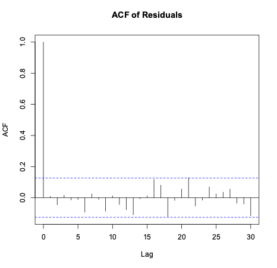
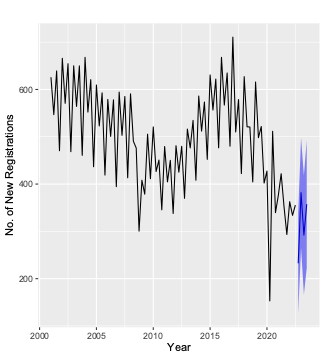

# Time Series and Forecasting
Analysing daily mean measurements of the nitrous oxides level - Analysing the number of new cars registered in England

## Challenge 1: Nitrous Oxides

In this project, we will analyse a dataset containing daily mean measurements of nitrous oxide levels (in µg/m³) recorded at a location on the A23 Purley Way road in the London Borough of Croydon from 1st February 2017 to 30th September 2017 (inclusive). Our goal is to fit a suitable time series model to describe these data, allowing us to better understand the underlying patterns.

Following data exploration, preprocessing, and model fitting, we came to the conclusion that the $ARIMA(1,1,1)$x$(1,1,1)_{7}$ model, was the best model for this dataset.

This model effectively captures the underlying patterns and seasonality in the nitrous oxide levels, allowing us to make accurate forecasts and better understand the factors influencing air pollution in the area. 

## Challenge 2: New Car Registrations

In this research, the number of new car registrations in England are analysed each quarter from Q1 2001 to Q3 2022, and the number of new car registrations in Q4 2022 and Q1, Q2, and Q3 of 2023 are also predicted. This study's primary goal is to give industry stakeholders an understanding of the trends and patterns in new car registrations so that they can better plan their sales, marketing, and production efforts.

We started by looking into the underlying trends and patterns in the data. Then, we created the $ARIMA(1,1,1)$x$(0,1,1)_{4}$ time series model. By testing the assumptions of normality, independence, and constant variance for the residuals, the model was proven to be accurate.

The chosen model was used to calculate the anticipated new automobile registration numbers for Q4 2022 and Q1, Q2, and Q3 of 2023, as well as any associated uncertainties. Forecasts show that new automobile registrations are anticipated to rise in Q1 2023, fall in Q2 2023, and then rise once more in Q3 2023.  

In summary, this study offers insightful analysis of the trends and patterns of new car registrations in England as well as precise projections for the upcoming quarters.

